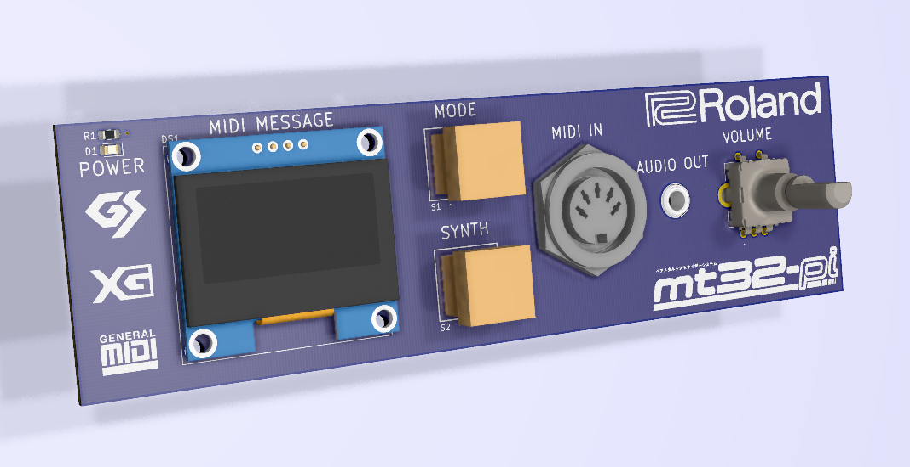
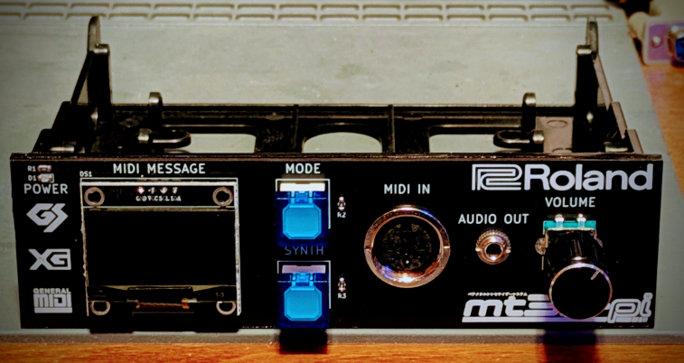
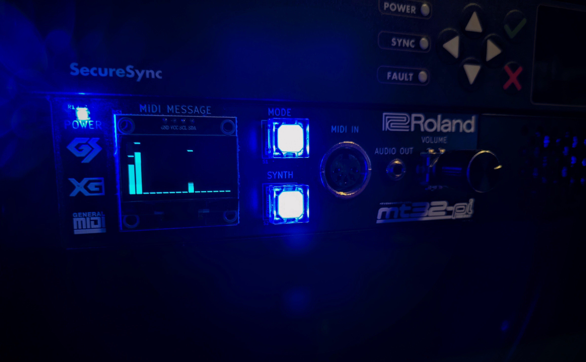
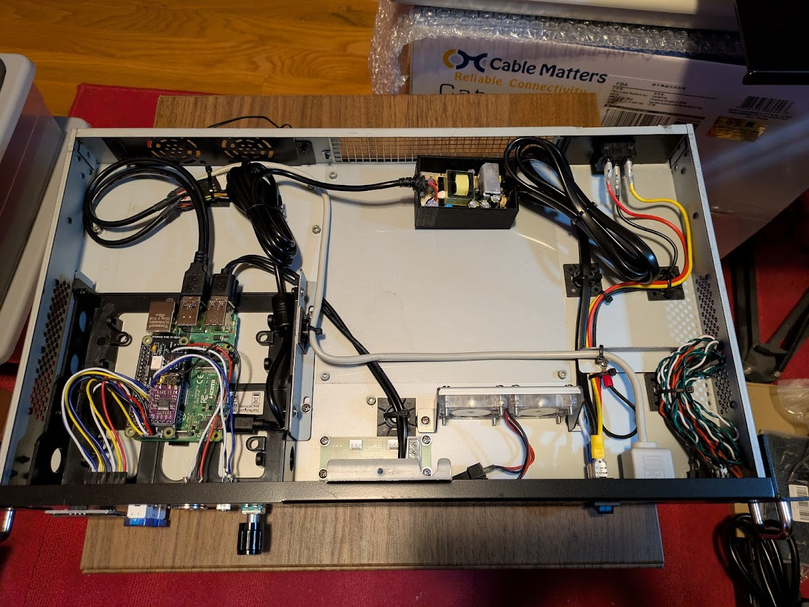
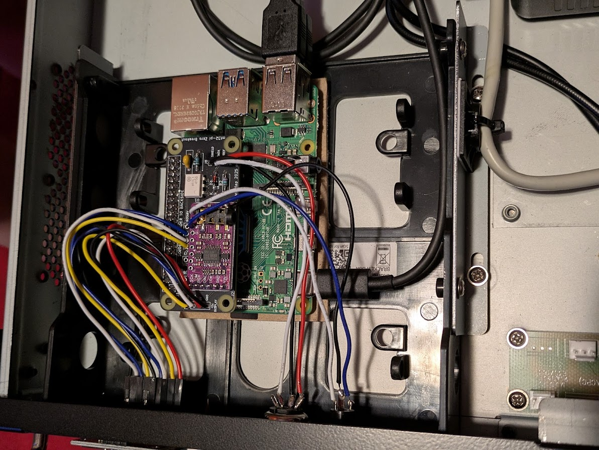
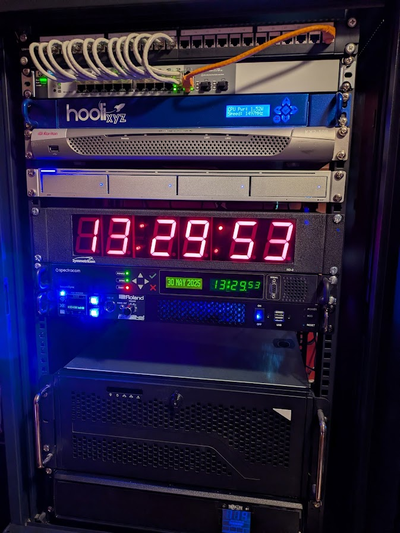

# mt32-pi-bay
A 5.25" bay panel overlay to control the mt32-pi. 
\
\

## Info
The core project design is attributed to Dale Whinham and his awesome mt32-pi project. Repo link: https://github.com/dwhinham/mt32-pi
\
\
This PCB I designed is a 5.25" bay front panel overlay to control the mt32-pi system. It features a power LED, 1.3" OLED, two push buttons, rotary encoder knob, MIDI input jack, and a 3.5mm headphone output jack.
\
\
I have included the full KiCad project along with the Mouser Cart, BOM, and Gerber files for ease of upload.
\
\
This is designed for use with my mt32-pi-zero-breakout project found here: https://github.com/wiretap-retro/mt32-pi-zero-breakout/
\
\
Both the breakout board and 5.25 bay are 100% tested and functional. 

## Parts
The parts in the BOM and Mouser Cart are for building a blue illuminated unit. You can choose other color illuminated components, however you will need to change the resistors to different values since the forward voltage of the LED will be different. Regardless, you should calculate the LED resistors for your desired current/brightness based on the product datasheet curves. The BOM as-is makes the buttons look great, however the power LED is a little bright and could use a slightly higher resistor value.
\
\
Please read the original mt32-pi repository linked in the information section for compatibility of parts if you fork the design or deviate from the chosen parts.

## Assembly
- First solder all the components to the board. To keep the screen low-profile, no pin header socket should be used.
- Solder your wire pigtails to the DIN connector and 3.5mm connector.
- Next, insert the DIN and 3.5mm receptacles into the panel and secure them with the lock nuts.
- Test fit the assembled PCB to the StarTech bay adapter. There are going to be slight interferences from the solder fillets sticking out. Trim the bay adapter with a rotary tool or your preferred cutting method. 
- Clean the StarTech bay panel face and rear side of the PCB with isopropyl alcohol.
- Smear a thin layer of silicone caulk on the StarTech bay panel face.
- Set the PCB onto the bay panel face and apply a small amount of force to allow the caulk to spread and adhere. Shift it around to align it with the edges if necessary. 
- Allow a dry time of 24hrs so the PCB fully cures to the bay adapter face.
- Mount your mt32-pi into the StarTech bay adapter and connect the 2.54mm pitch DuPont connectors to the panel header.

## Finished Product

\

\

\

\

\
## Revision Notes
Rev 1 2025-05-28 --- Remapped rotary encoder CW/CCW pins for proper volume up/down when physically turned. \
Rev 0 2025-05-03 --- Cleaned up assembly instructions, added knob to other BOM items section.

## License
This project uses the UNLICENSE. Feel free to do what you want with it. Check over the project before ordering. Build at your own risk.
